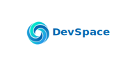

# DevSpace

</img>

DevSpace es una red social con la que aprender sobre cualquier lenguaje de programación. Esta aplicación móvil trata de dinamizar y mejorar el aprendizaje de un nuevo lenguaje o tecnología de forma autodidacta, a través de publicaciones, comentarios y mensajes entre usuarios de esta app.

## Descripción

Mi proyecto se basa en una red social escrita en Java (Android), cuyo principal objetivo es proponer una nueva forma de estudio a cualquier persona interesada en aprender sobre lenguajes de programación.

Además fomenta el uso de código abierto y sirve como escaparate o forma de promoción para aquellos que publican sus conocimientos sobre el tema. Algunas de las funcionalidades que implementa son :
* **Sistema de mensajería instantánea**. Para facilitar la comunicación entre usuarios que tengan alguna duda, quieran contribuír a un proyecto, ...

* **Publicaciones**. Estas son la principal funcionalidad de la aplicación. Mediante estas el usuario puede publicar imágenes, vídeos e incluso documentación externa a DevSpace de su código.

* **Buscador**. Mediante el buscador podrás filtrar las publicaciones que desees encontrar.

Le quiero dar un enfoque de desenvolvimiento de un entregable al proyecto, y así continuar con el prototipo en el que trabajé durante el ciclo en PMDM (Programación Multimedia e Dispositivos Móbiles).
Las tecnologías usadas son **Java** (_Android_) para la creación de la aplicación en sí, y para la parte de la base de datos escogí **Firebase**. Esta tecnología no fue vista en el ciclo y aporta la infraestructura necesaria para presentar un prototipo de aplicación en condiciones. Usando los servicios de Firebase, pude conectar mi aplicación a una base de datos remota con la que autenticar a mis usuarios, guardar sus publicaciones, imágenes, vídeos, etc.

## Instalación / Puesta en marcha

Sigue estos pasos para instalar la aplicación en tu dispositivo móvil o para descargar el repositorio del proyecto en la .

> *TODO*: Actualizar el .apk publicado al terminar la aplicación

## Uso

Las interfaces de DevSpace se crearon con el objetivo de que fuesen lo mas intuitivas posibles, y los usos de la aplicación son:

1. Crear una nueva cuenta en DevSpace.
2. Configurar las preferencias de su cuenta.
3. Crear publicaciones con las que compartir código con la comunidad.
4. Interactuar con las publicaciones de otros usuarios a través de likes y comentarios.
5. Comunicarse con otros usuarios mediante el sistema de mensajería instantánea.

Para más información sobre los diferentes usos de la aplicación, consulta el 

## Sobre el autor

Cristian Mayán Barreiros, estudiante en el _IES San Clemente_ cursando el Ciclo Superior de **Desarrollo de Aplicaciones Multiplataforma**.

Tuve la idea de hacer esta aplicación porque durante mi período en San Clemente, me hubiese interesado una aplicación dinámica y amena con la que aprender sobre las diferentes tecnologías que se impartían en el ciclo. La tecnología principalmente usada en el proyecto fue **Java** (_Android_), ya que fue la tecnología mas desarrollada en el ciclo y que considero uno de mis fuertes. Dejo en este apartado un <a href="mailto: cristian.mayanb@gmail.com">email</a> con el que contactar conmigo fácilmente.

## Licencia

Este proyecto está distribuído y licenciado bajo los términos de *GNU Free Documentation License Version 1.3* . Términos y condiciones de uso especificados en 

## Índice

1. Anteproyecto
    * 1.1. [Idea](doc/templates/1_idea.md)
    * 1.2. [Necesidades](doc/templates/2_necesidades.md)
2. [Análisis](doc/templates/3_analise.md)
3. [Planificación](doc/templates/4_planificacion.md)
4. [Diseño](doc/templates/5_deseño.md)
5. [Implantación](doc/templates/6_implantacion.md)

## Guía de contribución

Cualquier persona interesada en contribuír en el proyecto lo puede hacer enviando un correo a 
Algunas ideas para futuras contribuciones:

* Añadir **tags** de búsqueda para facilitar el filtrado de publicaciones en el _SearchView_.
* Mejorar **componentes visuales** (_layouts_ y _drawables_).
* Aplicar o corregir las **arquitecturas**:
  * <a href="https://www.browserstack.com/guide/what-is-test-driven-development">**TDD** (Test Driven Development)</a>.
  * <a href="https://www.geeksforgeeks.org/mvp-model-view-presenter-architecture-pattern-in-android-with-example/">**MVP** (Model View Presenter)</a>.
  
    ### Contribuidores

    _Aquí publicaré a los contribuidores de este proyecto_

## References

* _Database_: <a href="https://firebase.google.com/?hl=es">Firebase</a>
* _Graphic Design_: <a href="https://inkscape.org/es/">Inkscape</a>
* Credits to _Coding Cafe_ for his <a href="https://www.youtube.com/playlist?list=PLxefhmF0pcPnTQ2oyMffo6QbWtztXu1W_">firebase android app</a> guide.
> *TODO*: Enlaces externos y descripciones de estos enlaces que creas conveniente indicar aquí. Generalmente ya van a estar integrados con tu documentación, pero si requieres realizar un listado de ellos, este es el lugar.
